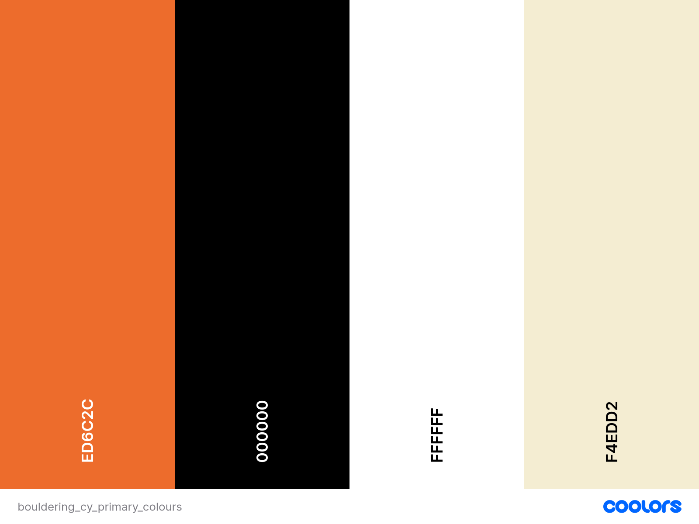
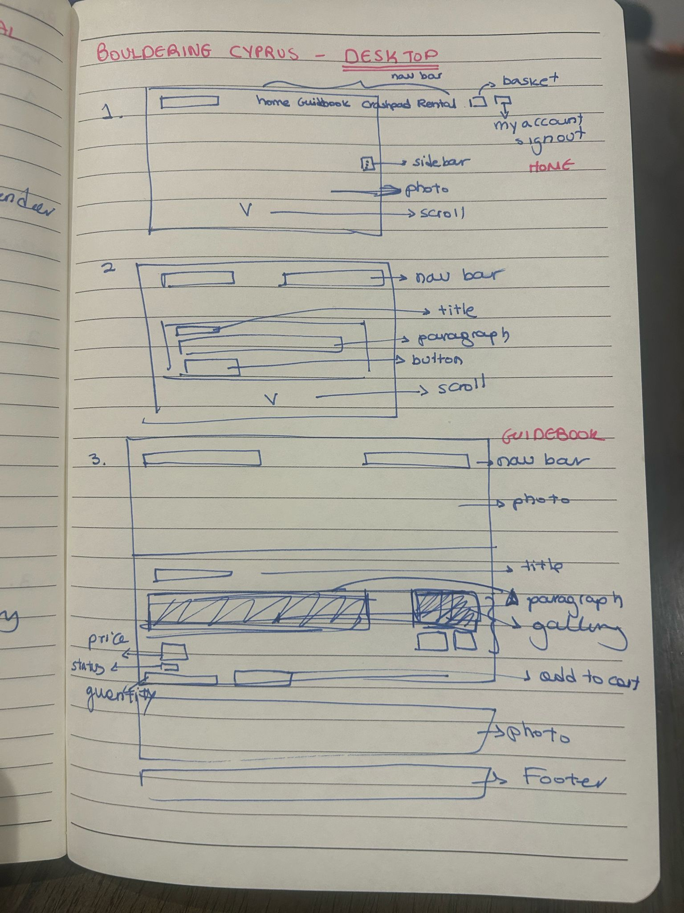
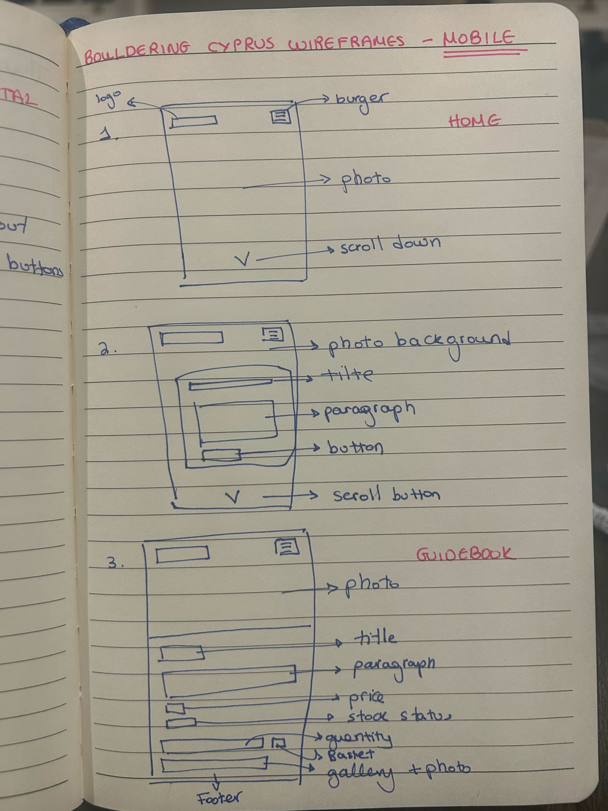
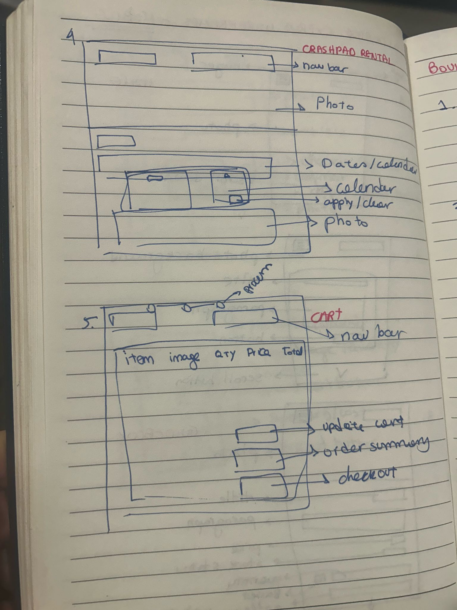
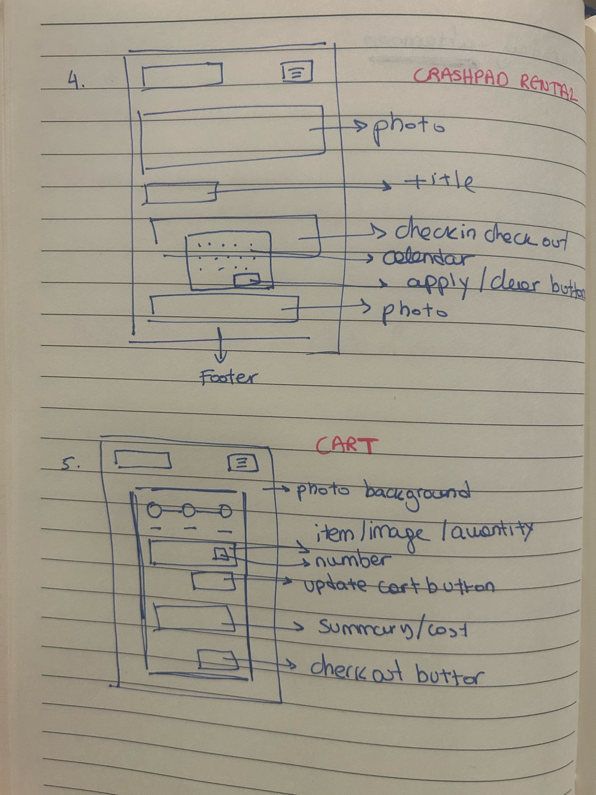
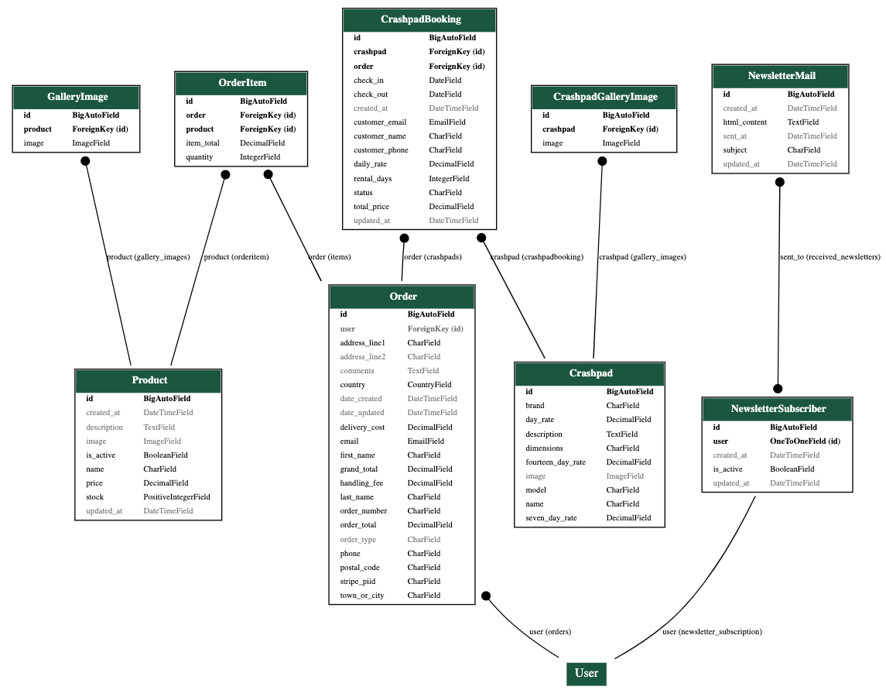
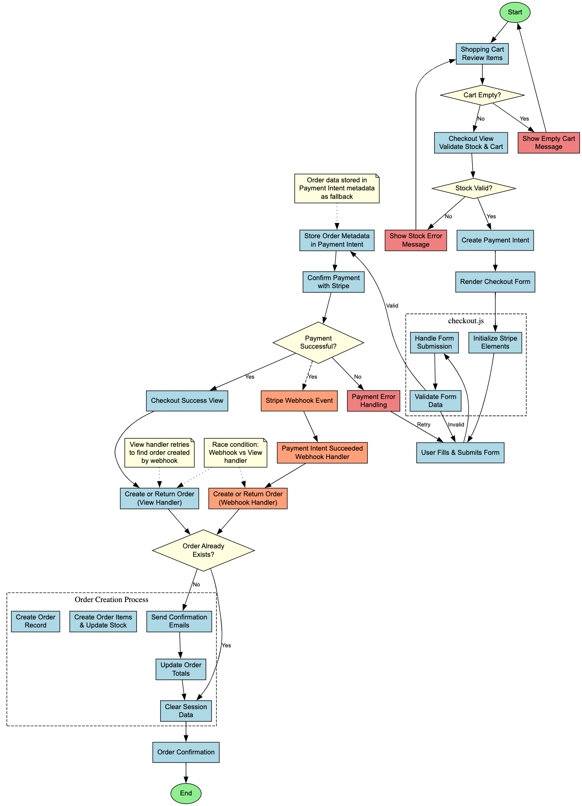
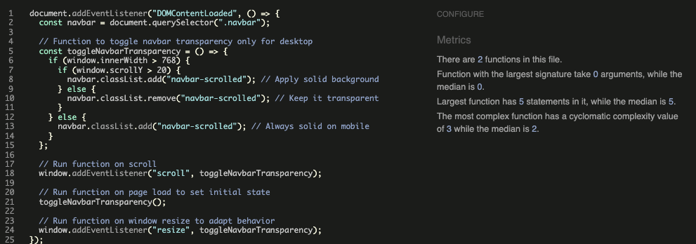
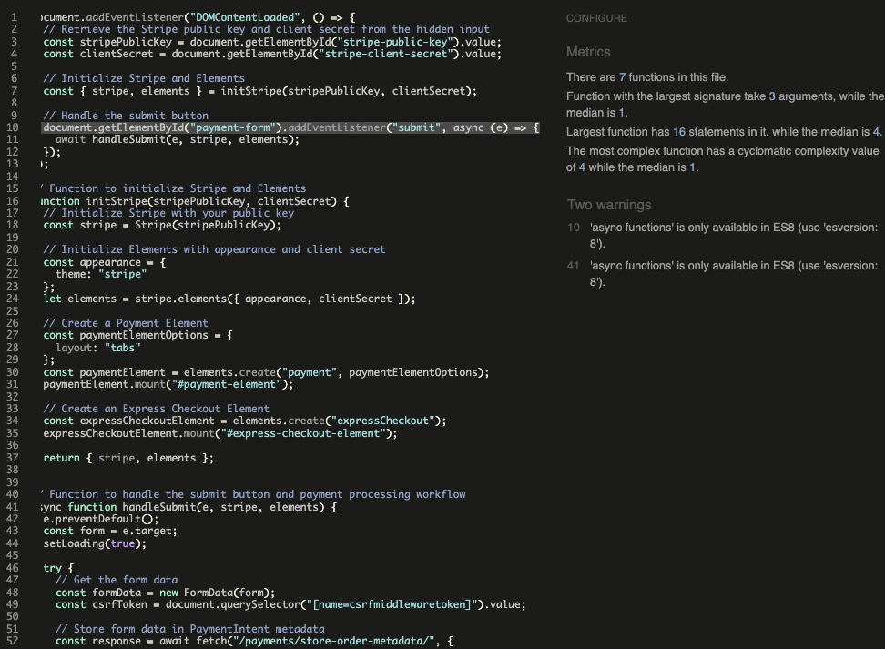

<h1 align="center">BOULDERING CYPRUS - Your Ultimate Guide to Bouldering in Cyprus</h1>

"Bouldering Cyprus" is a Django-based e-commerce web application designed to promote and support the bouldering community in Cyprus. The platform offers an online shop selling the comprehensive guidebook (physical book) for bouldering spots across the island, crashpad rentals. This application aims to make bouldering in Cyprus more accessible to both locals and tourists by providing essential information, equipment, and services. It is designed to be scalable and has the potential to easily host other related climbing products as the offering expands.

This is a real personal project that I aspire to progress further, refine and publish on the cyprusbouldering.com domain, following the completion of the Code Institute course.

<a href="https://bouldering-cyprus-53e1273cde1e.herokuapp.com/">ACCESS THE APPLICATION</a>

# App Overview

## App Purpose / User Goals
The Bouldering Cyprus app aims to serve as a central hub for the bouldering community in Cyprus by offering:

- **Guidebook:** The main purpose is to market and sell the Bouldering Cyprus Guidebook, a physical book containing detailed information about bouldering spots across Cyprus, including maps, route descriptions, and difficulty ratings.

- **Equipment Rental:** Offering crashpad rentals to visitors who don't want to travel with their own equipment or locals that do no yet own their own equipment.

- **E-commerce Platform:** Capacity to sell other guidebooks and bouldering-related products as the offering expands.

- **Community Building:** Creating a platform for the local bouldering community to connect and share information via the social media pages and the newsletter.

- **Newsletter Subscription:** Keeping users updated with the latest bouldering news, spot discoveries, and events in Cyprus.

## Key Features

- **Responsive Design:** Fully responsive website that works seamlessly across desktop, tablet, and mobile devices.

- **User Authentication:** Secure user registration and authentication system using Django Allauth.

- **Product Management:** Flexible product catalog with descriptions, images, and pricing.

- **Shopping Cart:** Intuitive shopping cart functionality allowing users to add, update, and remove items.

- **Secure Checkout:** Integration with Stripe for secure payment processing.

- **Crashpad Rental System:** Dedicated rental system for crashpads with date selection, availability checking and flexible pricing.

- **Order Management:** Complete order tracking and management system for both users and administrators.

- **Newsletter Subscription:** Email newsletter subscription system to keep users informed about bouldering news, new products, and potential offers.

- **Admin Dashboard:** Comprehensive admin interface for managing products, crashpads, orders, rentals, and users.

- **Error Monitoring:** Integration with Sentry for real-time error tracking and monitoring to prevent lingering bugs and issues that may affect the user experience.

# App Design & Planning

## User Stories
I followed the Agile methodology to plan and design the app, and made use of Github's project management features to issue and track epics, user stories, tasks and bugs. Detailed user stories are available in the [Github Project](https://github.com/users/dimispapa/projects/3/views/1).

Below are the epic stories and their relevant user stories:

### Epic Stories

#### E1: Selling the Cyprus Bouldering Guide Book
An e-commerce feature that enables the sale of the Cyprus Bouldering Guide Book

**User Stories:**
- ✅ S1.1: As a user, I want to browse the guide book product details and price, so I can decide to purchase it
- ✅ S1.2: As a user, I want to add the guide book to my cart, so I can review my order before checkout
- ✅ S1.3: As a user, I want to receive a confirmation email after purchasing, so I know my order was successful

#### E2: Crashpad Booking System
A Crashpad Booking System to allow viewing availability and booking crashpads, by paying online.

**User Stories:**
- ✅ S2.1: As a user, I want to check crashpad availability for specific dates, so I can plan my trip
- ✅ S2.2: As a user, I want to book a crashpad and pay online, so I can secure my rental
- ✅ S2.3: As an admin, I want to manage crashpad bookings, so I can track rentals and adjust availability

#### E3: Bouldering Info and Community Engagement
An page/area dedicated to providing key high-level information about the bouldering area. This should also include some references/links/embedded links to social media accounts (youtube videos, instagram/facebook posts). Provide links to newsletter subscription for community engagement.

**User Stories:**
- ✅ S3.1: As a user, I want to read an introduction to bouldering in Cyprus, so I can learn about the area
- ✅ S3.2: As a user, I want to follow Bouldering Cyprus on social media, so I can stay updated
- ✅ S3.3: As a user, I want to subscribe to the newsletter, so I can receive updates about new bouldering spots and events

#### E4: Front-End Design and User Experience
Front-End Design and User Experience. Ensure a visually appealing, interactive and seamless website.

**User Stories:**
- ✅ S4.1: As a user, I want a visually appealing and easy-to-use website, so I enjoy browsing and shopping
- ✅ S4.2: As a user, I want the website to load quickly and work smoothly, so I can have a good experience
- ✅ S4.3: As a user, I want a homepage that instantly gives me a quick view of the options to browse through with a quick summary

#### E5: Technical Setup and Integrations
Technical Setup and Integrations

**User Stories:**
- ✅ S5.1: As a developer, I want the website to be deployable, so I can make it available online
- ✅ S5.2: As a developer, I want a secure website, so users' data is protected

# Styles
The styles are based on the following design principles:

- **Responsive Design:** The website is designed to be responsive and work on all devices.
- **Element-First Approach:** The website is designed to follow an [element-first approach](https://cheewebdevelopment.com/element-first-scss-media-queries/), with a focus on designing media queries appropriate for each feature.
- **Consistency:** The website is designed to be consistent in its design and layout, with a focus on providing a great user experience. The styles are aligned with the fonts and colors chosen by the designer of the guidebook.

## Typography
The application uses a carefully selected combination of Google Fonts to create a clear visual hierarchy and ensure optimal readability:

#### Font Families
- **Primary Font (Body):** ["Roboto Mono"](https://fonts.google.com/specimen/Roboto+Mono) - Used for body text (except homepage) and general content including the navbar and footer
- **Secondary Font (Headings):** ["Roboto Condensed"](https://fonts.google.com/specimen/Roboto+Condensed) - Used for all heading levels (h1-h6) and homepage text content

#### Font Sizes
The application uses a responsive font sizing system:
- XXL: 2rem (32px) - Main headings
- XL: 1.8rem (28.8px)
- Large: 1.6rem (25.6px)
- Medium: 1.4rem (22.4px)
- Small: 1.2rem (19.2px)
- XS: 1rem (16px)
- XXS: 0.8rem (12.8px)

Font sizes are responsive and scale down through different breakpoints:
- Tablet Large: h1 → xl, h2 → large, h3 → medium
- Tablet: h1 → large, h2 → medium, h3/h4 → small
- Phone: h1 → medium, h2 → small, h3/h4 → xs
- Small Phone: h1 → small, h2 → xs

#### Content Sections
- Headings (h1, h2) in content sections use the brand orange color (#ed6c2c)
- Body text uses black (#000) for maximum readability
- Text content is responsive, scaling from medium size on desktop to xxs on small phones

## Colour Palette
The color palette is inspired by the fonts and colour [palette](./docs/images/colours/book_designer_palette.png) used by the book designer for the Cyprus Bouldering Guidebook:

| Color | Hex/RGBA |
|-------|----------|
| Orange | `#ed6c2c` / `rgba(237,108,44,0.9)` / `rgba(237,108,44,0.1)` |
| Black | `#000000` / `rgba(0,0,0,0.9)` / `rgba(0,0,0,0.1)` |
| White | `#ffffff` / `rgba(255,255,255,0.9)` |
| Beige | `#f4edd2` / `rgba(244,237,210,0.9)` |
| Dark Red | `#c25a46` / `rgba(194,90,70,0.9)` |
| Off Pink | `#caa098` / `rgba(202,160,152,0.9)` |
| Light Blue | `#cbdbe2` / `rgba(203,219,226,0.9)` |
| Light Green | `#b5cbb2` / `rgba(181,203,178,0.9)` |

The colour palette images below were created using the [coolors](https://coolors.co/) online tool.
### Primary Colours

### Secondary Colours

### Color Usage
- **Primary Brand Color:** Orange (`#ed6c2c`) - Used for headings and call-to-action elements
- **Background Colors:** Beige (`#f4edd2`) and White (`#ffffff`) - Used for different sections and content areas
- **Accent Colors:** Off Pink (`#caa098`), Dark Red (`#c25a46`), Light Blue (`#cbdbe2`), Light Green (`#b5cbb2`) - Used for various UI elements and highlights
- **Text Colors:** Black (`#000000`) for main content, White (`#ffffff`) for contrast on dark backgrounds

### Transparency Variants
- Semi-transparent variants (0.9 opacity) are used for overlay effects and hover states
- Transparent variants (0.1 opacity) are used for subtle backgrounds and transitions

## Wireframes
Wireframe handrawn sketches were created to plan the layout of the website at the design stage. The final sketches are below:

# Data Architecture

## Database & ORM
- **[PostgreSQL](https://www.postgresql.org/)**: Production database
- **[SQLite](https://www.sqlite.org/)**: Development/testing database
- **[Django ORM](https://docs.djangoproject.com/en/4.2/topics/db/)**: Database abstraction layer

## Database Design
The database design focuses on efficiently managing products, orders, rentals, and user data. The main models include:

- **User Model:** Extended Django user model with additional profile information
- **Product Model:** Stores information about guidebooks and other products available for purchase
- **Order Model:** Tracks customer orders, payment status, and delivery information
- **OrderItem Model:** Links products to orders with quantity and price information
- **Rental Model:** Manages crashpad rentals with date ranges and availability
- **Newsletter Model:** Stores subscriber information for the newsletter system

### Entity Relationship Diagram
The following diagram illustrates the relationships between the database models. This was generated using the [pydot](https://django-extensions.readthedocs.io/en/latest/graph_models.html) django extension which created a .dot file (see [erd_diagram.dot](./docs/erd_diagram.dot)) which was then used by the [dreampuf](https://dreampuf.github.io/GraphvizOnline/) GraphViz generator to generate this diagram.

## Data Models Schema

| Model | Fields | Field Types | Field Options | Related Model | Description |
|-------|---------|-------------|---------------|---------------|-------------|
| Product | name | CharField | max_length=255 | - | Product name |
| | description | TextField | blank=True, null=True | - | Product description |
| | price | DecimalField | max_digits=10, decimal_places=2 | - | Product price |
| | stock | PositiveIntegerField | default=0 | - | Available stock |
| | image | ImageField | upload_to="products/", blank=True, null=True | - | Product image |
| | created_at | DateTimeField | auto_now_add=True | - | Creation timestamp |
| | updated_at | DateTimeField | auto_now=True | - | Last update timestamp |
| | is_active | BooleanField | default=True | - | Product availability status |
| GalleryImage | product | ForeignKey | on_delete=CASCADE | Product | Related product |
| | image | ImageField | upload_to=product_gallery_upload_path | - | Gallery image |
| Order | order_number | CharField | max_length=32, unique=True | - | Unique order identifier |
| | user | ForeignKey | on_delete=SET_NULL, null=True | User | Customer who placed order |
| | first_name | CharField | max_length=50 | - | Customer first name |
| | last_name | CharField | max_length=50 | - | Customer last name |
| | email | EmailField | max_length=250 | - | Customer email |
| | phone | CharField | max_length=20 | - | Customer phone |
| | address_line1 | CharField | max_length=250 | - | Shipping address line 1 |
| | address_line2 | CharField | max_length=250, null=True | - | Shipping address line 2 |
| | town_or_city | CharField | max_length=100 | - | Shipping city |
| | postal_code | CharField | max_length=20 | - | Shipping postal code |
| | country | CountryField | - | - | Shipping country |
| | date_created | DateTimeField | auto_now_add=True | - | Order creation date |
| | date_updated | DateTimeField | auto_now=True | - | Order last update |
| OrderItem | order | ForeignKey | on_delete=CASCADE | Order | Related order |
| | product | ForeignKey | on_delete=CASCADE | Product | Ordered product |
| | quantity | IntegerField | default=1 | - | Quantity ordered |
| | item_total | DecimalField | max_digits=10, decimal_places=2 | - | Total for line item |
| Crashpad | name | CharField | max_length=100 | - | Crashpad name |
| | brand | CharField | max_length=100 | - | Crashpad brand |
| | model | CharField | max_length=100 | - | Crashpad model |
| | dimensions | CharField | max_length=100 | - | Crashpad dimensions |
| | description | TextField | - | - | Crashpad description |
| | day_rate | DecimalField | max_digits=10, decimal_places=2 | - | Daily rental rate |
| | seven_day_rate | DecimalField | max_digits=10, decimal_places=2 | - | Weekly rental rate |
| | fourteen_day_rate | DecimalField | max_digits=10, decimal_places=2 | - | Fortnightly rental rate |
| | image | ImageField | upload_to='crashpads/' | - | Crashpad image |
| CrashpadBooking | crashpad | ForeignKey | on_delete=CASCADE | Crashpad | Booked crashpad |
| | order | ForeignKey | on_delete=CASCADE | Order | Related order |
| | check_in | DateField | - | - | Rental start date |
| | check_out | DateField | - | - | Rental end date |
| | rental_days | IntegerField | editable=False | - | Total rental days |
| | daily_rate | DecimalField | max_digits=10, decimal_places=2 | - | Applied daily rate |
| | total_price | DecimalField | max_digits=10, decimal_places=2 | - | Total rental price |
| | status | CharField | max_length=10, choices | - | Booking status |
| | created_at | DateTimeField | auto_now_add=True | - | Booking creation date |
| | updated_at | DateTimeField | auto_now=True | - | Booking last update |
| | customer_name | CharField | max_length=255 | - | Customer full name |
| | customer_email | EmailField | - | - | Customer email |
| | customer_phone | CharField | max_length=20 | - | Customer phone |

## Implementation
The database is implemented using PostgreSQL in production and SQLite for development/testing. Django ORM is used for database operations, providing a clean abstraction layer for data management.

Queries have been optimised for performance where possible, making use of Django ORM's `select_related` and `prefetch_related` methods to reduce the number of database queries for related objects.

# Payment Workflow

The payment workflow is implemented using Stripe. The Stripe API is used to process payments securely and set up webhooks to handle payment events.

## Checkout, Payment & Order Process Overview

The checkout process follows a robust flow designed to ensure payment security, data integrity, and a smooth user experience:

1. **Cart Validation**: Before entering checkout, the system validates that the cart is not empty and all items are in stock.

2. **Checkout Form**: Users enter their delivery and contact information through a form built with Django Crispy Forms.

3. **Payment Processing**: The application uses Stripe Elements to securely collect payment information without sensitive card data touching the server.

4. **Order Data Storage**: Before payment confirmation, all order data is stored in the Stripe Payment Intent's metadata as a fallback mechanism.

5. **Dual-Path Order Creation**: The system implements a redundant order creation process:
   - **Primary Path**: Stripe webhooks receive payment confirmation events and create orders server-side
   - **Fallback Path**: The browser-based checkout success page attempts to create the order if the webhook hasn't already done so

6. **Stock Management**: Product stock levels are updated only after successful payment confirmation.

7. **Order Confirmation**: Users receive both on-screen confirmation and email notifications for their orders.

## Redundancy and Error Handling

The payment system is designed with multiple layers of redundancy:

- **Session vs. Metadata**: Order data is stored in both the user's session and the Payment Intent metadata
- **Webhook vs. Browser**: Orders can be created via either the webhook handler or the browser redirect
- **Multiple Stock Checks**: Stock is validated at multiple points to prevent overselling
- **Idempotent Operations**: All order creation operations are idempotent to prevent duplicate orders

## Process Flow Diagram

The following diagram illustrates the complete checkout-to-payment-to-order workflow:

# Technologies & Tools Stack

This project utilizes a robust stack of technologies and tools to deliver a seamless experience in development and functionality:

## Programming Languages
- **[Python](https://www.python.org/)**: The core programming language used for backend logic and full-stack application development. Followed the [PEP8](https://pep8.org/) style guide for Python code by using the [Flake8](https://flake8.pycqa.org/) linter.
- **[JavaScript](https://developer.mozilla.org/en-US/docs/Web/JavaScript)**: For dynamic front-end functionality and interactive features. Some backend functionality was implemented in JavaScript, such as initiating the payment process with Stripe and making API calls to store order metadata.
- **[HTML5](https://developer.mozilla.org/en-US/docs/Web/Guide/HTML/HTML5)**: Structuring web pages, holding static content and placing placeholders for dynamic content with semantic markup. Made use of Bootstrap 5 classes for quick responsive styling as well as Django Template Language for dynamic content based on context data.
- **[CSS3](https://developer.mozilla.org/en-US/docs/Web/CSS)**: For styling the front-end and ensuring a responsive design. CSS was written in SCSS and compiled to CSS using the [live SASS compiler](https://marketplace.visualstudio.com/items?itemName=glenn2223.live-sass).

## Frameworks
- **[Django 4.2 LTS](https://docs.djangoproject.com/en/4.2/)**: A high-level Python web framework that enables rapid development and clean, pragmatic design. Followed the [Model-View-Template](https://docs.djangoproject.com/en/4.2/topics/class-based-views/intro/) approach for the templates.
- **[Bootstrap 5](https://getbootstrap.com/)**: For responsive design and pre-styled components.

### Django Libraries & Packages
- **[Django Allauth](https://django-allauth.readthedocs.io/)**: For user authentication, registration, and account management.
- **[Django Crispy Forms](https://django-crispy-forms.readthedocs.io/)**: For rendering beautiful and customizable forms.
- **[Django Summernote](https://github.com/summernote/django-summernote)**: For rich text editing in the admin interface.
- **[Django Storages](https://django-storages.readthedocs.io/)**: For handling file storage with AWS S3.
- **[Django REST Framework](https://www.django-rest-framework.org/)**: For building robust APIs for the rentals booking system.

### JavaScript Libraries
| Library | Version | Use |
| ------- | ------- | --- |
| [jQuery](https://jquery.com/) | 3.7.1 | DOM manipulation, AJAX requests |
| [Stripe.js](https://stripe.com/docs/js) | Latest | Payment form handling |
| [Bootstrap JS](https://getbootstrap.com/) | 5.3.2 | UI components, modals, tooltips |
| [Daterangepicker](https://www.daterangepicker.com/) | 3.1.0 | Date picker for rental bookings |
| [Moment.js](https://momentjs.com/) | 2.30.1 | Date and time parsing and formatting |
| [Moment-timezone.js](https://momentjs.com/timezone/) | 0.5.43 | Timezone support |

#### Testing Libraries & Tools
- **[Selenium](https://www.selenium.dev/)**: For automated browser testing and frontend integration tests
- **[Django Test Client](https://docs.djangoproject.com/en/4.2/topics/testing/tools/#the-test-client)**: For testing Django views and request handling
- **[Coverage.py](https://coverage.readthedocs.io/)**: For measuring code coverage of Python tests
- **[unittest](https://docs.python.org/3/library/unittest.html)**: Python's built-in testing framework used with Django's test suite
- **[ChromeDriver](https://chromedriver.chromium.org/)**: WebDriver for Chrome used with Selenium tests
- **[django.test.TestCase](https://docs.djangoproject.com/en/4.2/topics/testing/tools/#testcase)**: Django's base test class with additional test functionality
- **[StaticLiveServerTestCase](https://docs.djangoproject.com/en/4.2/topics/testing/tools/#django.test.LiveServerTestCase)**: For testing with a live server instance, used with Selenium
- **[model_bakery](https://model-bakery.readthedocs.io/)**: For easily generating test data based on models.

### Third Party Services
- **[Stripe](https://stripe.com/)**: For secure payment processing.
- **[AWS S3](https://aws.amazon.com/s3/)**: For storing static and media files.
- **[Sentry](https://sentry.io/)**: For error tracking and monitoring.
- **[SendGrid](https://sendgrid.com/)**: For email marketing and notifications.

### Development Tools
- **[Git](https://git-scm.com/)**: For version control.
- **[GitHub](https://github.com/)**: For source code management.
- **[GitHub Projects](https://github.com/features/projects)**: For project management.
- **[VS Code](https://code.visualstudio.com/)**: As the primary code editor.
- **[Chrome DevTools](https://developers.google.com/web/tools/chrome-devtools)**: For inspecting, debugging and testing.

### Deployment & Hosting
- **[Heroku](https://www.heroku.com/)**: For application hosting.
- **[AWS CloudFront](https://aws.amazon.com/cloudfront/)**: For content delivery network services to cache static files and improve performance.

# Testing & Monitoring

## Automated Testing

### Test Modules

#### Cart Tests
- **Cart Class Tests (`cart/test_cart_class.py`):**
  - Tests basic cart operations (add, update, remove)
  - Validates cart calculations and totals
  - Tests cart validation (stock, dates)
  - Verifies cart serialization

- **Context Processor Tests (`cart/test_cart_context.py`):**
  - Tests cart summary contexts
  - Validates price calculations
  - Tests context data structure

- **View Tests (`cart/test_cart_views.py`):**
  - Tests cart operations and display
  - Validates error handling
  - Tests cart updates and checkout flow

#### Orders Tests (`orders/test_orders_models.py`)
- **Order Model Tests:**
  - Tests order creation and validation
  - Validates order calculations
  - Tests order type determination
  - Verifies stock management

- **Order Item Tests:**
  - Tests item creation and relationships
  - Validates calculations
  - Tests string representations

#### Payment Utility Tests (`payments/test_payment_utils.py`)
- **Error Message Tests:**
  - Tests error message generation for different error types
  - Validates message content for stock issues
  - Tests message content for date-related errors

- **Stock Validation Tests:**
  - Tests validation of cart items
  - Validates error handling for insufficient stock
  - Tests date validation for rentals
  - Verifies error reporting

- **Order Creation Tests:**
  - Tests order lookup with payment intents
  - Validates retry mechanism for order creation
  - Tests order creation timing and race conditions

- **Order Item Creation Tests:**
  - Tests creation of product order items
  - Tests creation of rental bookings
  - Validates mixed order types
  - Verifies stock updates after order creation

- **Email Notification Tests:**
  - Tests order confirmation emails
  - Tests rental confirmation emails
  - Validates error handling in email sending

#### Newsletter Tests (`newsletter/test_newsletter.py`)
- **Subscription Tests:**
  - Tests subscription/unsubscription flows
  - Validates email sending
  - Tests subscription management

- **Newsletter Sending Tests:**
  - Tests SendGrid integration
  - Validates management commands
  - Tests tracking and monitoring

### Test Configuration
- **Test Data Generation:**
  - Uses `model_bakery` for test data
  - Creates realistic model instances
  - Handles complex data scenarios

- **Test Case Setup:**
  - Uses `TestCase` for Django views
  - Uses `StaticLiveServerTestCase` for live testing
  - Implements `RequestFactory` for isolated testing

- **Mock Configurations:**
  - Implements mock objects for external services
  - Simulates payment flows
  - Handles test sessions and authentication

### Test Coverage

The application has an overall test coverage of 89% from automated testing. Below is a summary of the test coverage report:

## Manual Testing
Automated testing is complemented by manual testing to ensure the application is fully functional and user-friendly. Below is a summary of the manual testing performed:

- **Responsive Design:** Tested across multiple devices and screen sizes
- **Browser Compatibility:** Tested on Chrome, Firefox, Safari, and Edge
- **User Flows:** Tested complete user journeys:
  - Product browsing and cart management
  - Rental date selection and booking
  - Checkout process and payment
  - Account management and newsletter subscription
- **Payment Processing:** Verified Stripe integration:
  - Tested successful/failed payments
  - Validated webhook handling
  - Tested order confirmation flow
- **Error Handling:** Tested form validation and edge cases

## Error Monitoring
- **Sentry Integration:**
  - Real-time error tracking
  - Contextual error information
  - Frontend/backend error logging
  - Alert configuration for critical issues

- **Logging:**
  - Configured logging with multiple loggers for different parts of the application
  - Logged info at various steps throughout the application for easier debugging of errors and warnings
  - Logging handler set up to notify admin via email of critical errors

# Bugs & Fixes
## Fixed Bugs
Fixed bugs are listed below from latest to earliest, with the commit hash and a link to the commit.

| Bug | Description | Fix | Commit |
|-----|-------------|-----|--------|
| CDN Loading Performance | Slow page loading due to CDN resource loading | Moved CDN resources to local files and optimized loading sequence | [e928309](https://github.com/dimispapa/bouldering-cyprus/commit/e928309) |
| CDN Migration Bug | Functionality broken after moving CDN resources locally | Fixed script references and ensured proper loading order | [b1693ac](https://github.com/dimispapa/bouldering-cyprus/commit/b1693ac) |
| Accessibility Issues | HTML validation errors affecting accessibility | Fixed form labels, added missing alt attributes, and corrected ARIA roles | [e1e3c92](https://github.com/dimispapa/bouldering-cyprus/commit/e1e3c92) |
| HTML Validation Issues | Various HTML validation errors | Fixed invalid HTML structure and attributes | [d5517cc](https://github.com/dimispapa/bouldering-cyprus/commit/d5517cc) |
| Sentry Context Variable | Sentry error tracking running during tests | Added SENTRY_ENABLED variable to control when error tracking is active | [f9cc8af](https://github.com/dimispapa/bouldering-cyprus/commit/f9cc8af) |
| Database N+1 Query Problem | Inefficient database queries causing performance issues | Optimized queries using select_related and prefetch_related | [550eb2d](https://github.com/dimispapa/bouldering-cyprus/commit/550eb2d) |
| Order Saving Issue | Orders only saving the first time they were created | Fixed logic in order creation to prevent duplicate saves | [183b41f](https://github.com/dimispapa/bouldering-cyprus/commit/183b41f) |
| Date Validation Function | Issue with rental date validation function | Fixed validation logic to properly check date ranges | [cc05edb](https://github.com/dimispapa/bouldering-cyprus/commit/cc05edb) |
| Template Title Error | Incorrect title in template | Fixed template title to match page content | [63cbdff](https://github.com/dimispapa/bouldering-cyprus/commit/63cbdff) |
| Newsletter Email Rendering | Images and links in newsletter emails not rendering correctly | Fixed static URL paths for email templates | [65eb6bd](https://github.com/dimispapa/bouldering-cyprus/commit/65eb6bd) |
| Unsubscribe URL | Incorrect unsubscribe URL in newsletter emails | Fixed URL generation in email templates | [2b9e518](https://github.com/dimispapa/bouldering-cyprus/commit/2b9e518) |
| Cart Rental Days Calculation | Incorrect calculation of rental days in cart | Fixed calculation logic for rental period | [b6a1669](https://github.com/dimispapa/bouldering-cyprus/commit/b6a1669) |
| Mobile Keyboard Popup | Mobile keyboard automatically appearing on date picker | Prevented keyboard popup on date picker fields | [8096dc1](https://github.com/dimispapa/bouldering-cyprus/commit/8096dc1) |
| Crashpad Pickup Address | Issue with crashpad pickup address object | Fixed object structure and reference | [e93ae81](https://github.com/dimispapa/bouldering-cyprus/commit/e93ae81) |
| Security Information Exposure | Sensitive information exposed in API response | Removed sensitive data from API responses | [66f6f6e](https://github.com/dimispapa/bouldering-cyprus/commit/66f6f6e) |
| Cart JSON Serialization | Inconsistent cart data serialization | Fixed JSON serialization for cart data | [80bf001](https://github.com/dimispapa/bouldering-cyprus/commit/80bf001) |
| Crashpad Availability Checks | Incorrect availability checking for crashpads | Fixed API checks for crashpad availability | [35818d3](https://github.com/dimispapa/bouldering-cyprus/commit/35818d3) |
| Webhook Form Data Handling | Issue with form data in webhook retry | Fixed handling of form data during webhook retries | [3c47e0b](https://github.com/dimispapa/bouldering-cyprus/commit/3c47e0b) |
| Cart Clearing After Success | Cart not properly clearing after successful checkout | Fixed cart clearing logic after successful order | [dd2de83](https://github.com/dimispapa/bouldering-cyprus/commit/dd2de83) |
| Empty Cart Addition | Issue when adding items to an empty cart | Fixed cart initialization for first item | [15e1999](https://github.com/dimispapa/bouldering-cyprus/commit/15e1999) |
| Duplicate Order Creation | Orders being created twice due to race conditions | Implemented uniqueness constraints and delayed view handler | [1f6013c](https://github.com/dimispapa/bouldering-cyprus/commit/1f6013c) |
| Payment Intent Amount | Final payment intent amount not including delivery | Ensured delivery costs are included in final payment amount | [c73e052](https://github.com/dimispapa/bouldering-cyprus/commit/c73e052) |
| Integer Conversion Error | Invalid integer error when updating payment intent | Fixed type conversion for payment amount | [251d3f4](https://github.com/dimispapa/bouldering-cyprus/commit/251d3f4) |
| Email SMTP Settings | Email configuration issues preventing sending | Fixed SMTP settings for proper email delivery | [2b5c5a1](https://github.com/dimispapa/bouldering-cyprus/commit/2b5c5a1) |
| Webhook Handler Test Variable | Incorrect setting of test webhook handler variable | Fixed variable assignment for test environment | [05ba871](https://github.com/dimispapa/bouldering-cyprus/commit/05ba871) |
| Form Data Redundancy | Redundant code in form data handling | Removed duplicate code and streamlined form processing | [8eac5e8](https://github.com/dimispapa/bouldering-cyprus/commit/8eac5e8) |
| DOM Security Vulnerability | DOM text reinterpreted as HTML causing security risk | Fixed text handling to prevent XSS vulnerability | [cc7bc10](https://github.com/dimispapa/bouldering-cyprus/commit/cc7bc10) |
| Exposed Error Details | Error details exposed in JSON responses | Removed sensitive error information from responses | [e84c47d](https://github.com/dimispapa/bouldering-cyprus/commit/e84c47d) |
| Email Port Configuration | Incorrect email port settings | Updated email port configuration for proper delivery | [276ff94](https://github.com/dimispapa/bouldering-cyprus/commit/276ff94) |
| Operand Addition Error | Issue with decimal + float operand addition | Fixed type handling for numeric operations | [ab6aa1f](https://github.com/dimispapa/bouldering-cyprus/commit/ab6aa1f) |
| Static Files Cache Busting | Browser caching old versions of static files | Enabled cache busting for static files | [d93159d](https://github.com/dimispapa/bouldering-cyprus/commit/d93159d) |
| S3 Storage Configuration | Issues with AWS S3 file storage settings | Fixed S3 settings and custom storage configuration | [2d7799a](https://github.com/dimispapa/bouldering-cyprus/commit/2d7799a) |
| Navbar Color Responsiveness | Navbar color issues on different screen sizes | Fixed responsive color styling for navbar | [ec07820](https://github.com/dimispapa/bouldering-cyprus/commit/ec07820) |
| S3 Custom Storage Spacing | Formatting issue in custom storage class | Added proper spacing in S3 storage configuration | [a8ebc12](https://github.com/dimispapa/bouldering-cyprus/commit/a8ebc12) |
| Down Arrow Visibility | Down arrow hiding unexpectedly on homepage | Fixed visibility and added bounce animation to arrows | [e59eaf9](https://github.com/dimispapa/bouldering-cyprus/commit/e59eaf9) |
| Static Root Configuration | Missing STATIC_ROOT setting for deployment | Added proper static root configuration | [4f8e691](https://github.com/dimispapa/bouldering-cyprus/commit/4f8e691) |
| Python Version Format | Incorrect Python version format in configuration | Fixed version specification format | [f7bf45a](https://github.com/dimispapa/bouldering-cyprus/commit/f7bf45a) |
| AWS S3 Configuration | Issues with AWS S3 settings for production | Updated S3 configuration for proper file storage | [318a5af](https://github.com/dimispapa/bouldering-cyprus/commit/318a5af) |
| Arrow Styling Issues | Inconsistent arrow styling on homepage | Fixed arrow styling and animation | [be93e77](https://github.com/dimispapa/bouldering-cyprus/commit/be93e77) |
| Navigation Hover Effect | Missing hover effect on navigation items | Added bold hover effect to improve user experience | [c668ae4](https://github.com/dimispapa/bouldering-cyprus/commit/c668ae4) |

## Version Control and Repository Management

- **Repository Management:**
  - Used GitHub for version control
  - Implemented branches for development and deployment
  - Implemented pull requests for merging branches into main
  - Used GitHub rules to prevent merging to main with errors
  - Implemented code scanning and security checks

## Code Validation

### HTML Validation
All pages were validated using the [W3C HTML Validator](https://validator.w3.org/).

| Page | Result | Notes | Screenshot |
|------|---------|-------|------------|
| Home | Pass | No errors |  |
| Shop | Pass | No errors |  |
| Cart | Pass | No errors |  |
| Checkout | Pass | No errors |  |
| Checkout Success | Pass | No errors |  |
| Account | Pass | No errors |  |
| Manage Newsletter | Pass | No errors |  |
| Password Reset | Pass | No errors |  |
| Password Change | Pass | No errors |  |
| Signup | Pass | No errors |  |
| Sign In | Pass | No errors |  |
| Sign Out | Pass | No errors |  |
| Verification Sent | Pass | No errors |  |
| Verify Email | Pass | No errors |  |
| Delete Account | Pass | No errors |  |
| Rentals | Pass | No errors |  |
| 404 | Pass | No errors |  |
| 403 | Pass | No errors |  |
| 500 | Pass | No errors |  |

### CSS Validation
All CSS files were validated using the [W3C CSS Validator](https://jigsaw.w3.org/css-validator/).

| File | Result | Notes | Screenshot |
|------|---------|-------|------------|
| base.css | Pass | No errors |  |
| index.css | Pass | No errors |  |
| accounts.css | Pass | No errors |  |
| error-pages.css | Pass | No errors |  |
| cart.css | Pass | No errors |  |
| bookings.css | Pass | No errors |  |
| checkout.css | Pass | No errors |  |
| checkout-success.css | Pass | No errors |  |
| home.css | Pass | No errors |  |
| shop.css | Pass | No errors |  |
| rentals.css | Pass | No errors |  |

### JavaScript Validation
All JavaScript files were validated using the [JSHint](https://jshint.com/) validator.

| File | Result | Notes | Screenshot |
|------|---------|-------|------------|
| booking.js | Pass | No errors |  |
| index.js | Pass | No errors |  |
| navbar.js | Pass | No errors |  |
| shop.js | Pass | No errors |  |
| toasts.js | Pass | No errors |  |
| sentry.js | Pass | No errors |  |
| checkout.js | Pass | No errors |  |

## Lighthouse Audit

A test was carried out on the deployed website using the Lighthouse Audit tool within Chrome Dev Tools. There is some room for improvement, but overall the site is performant and accessible:

| Page | Size | Screenshot | Notes |
|------|------|------------|-------|
| Home | Mobile |  | No major problems |
| Home | Desktop |  | No major problems |
| Shop | Mobile |  | No major problems |
| Shop | Desktop |  | No major problems |
| Cart | Mobile |  | No major problems |
| Cart | Desktop |  | No major problems |
| Checkout | Mobile |  | No major problems |
| Checkout | Desktop |  | No major problems |
| Rentals | Mobile |  | No major problems |
| Rentals | Desktop |  | No major problems |
| Account | Mobile |  | No major problems |
| Account | Desktop |  | No major problems |

## Java

# Deployment

## Deployment to Heroku
The application is deployed on Heroku with the following configuration:

1. **Create a Heroku App:** Set up a new app on Heroku.
2. **Configure Environment Variables:** Set up all necessary environment variables in Heroku settings.
3. **Database Setup:** Provision a PostgreSQL database.
4. **Static Files:** Configure AWS S3 for static and media file storage. Use Cloudfront to cache static files and improve performance.
5. **Deploy:** Connect GitHub repository and enable automatic deployments. Enables Github security checks and code scanning, prevent commits to main branch with errors.

## Environment Variables
The following environment variables are required:

- `SECRET_KEY`: Django secret key
- `DATABASE_URL`: PostgreSQL database URL
- `AWS_ACCESS_KEY_ID`: AWS access key
- `AWS_SECRET_ACCESS_KEY`: AWS secret key
- `AWS_STORAGE_BUCKET_NAME`: S3 bucket name
- `STRIPE_PUBLIC_KEY`: Stripe public key
- `STRIPE_SECRET_KEY`: Stripe secret key
- `STRIPE_WEBHOOK_SECRET`: Stripe webhook secret
- `EMAIL_HOST_KEY`: SendGrid API key
- `DEFAULT_EMAIL`: Default sender email

## Local Development
To run the project locally:

1. Clone the repository: `git clone https://github.com/dimispapa/bouldering-cyprus.git`
2. Install dependencies: `pip install -r requirements.txt`
3. Set up environment variables in an `env.py` file
4. Run migrations: `python manage.py migrate`
5. Create a superuser: `python manage.py createsuperuser`
6. Run the server: `python manage.py runserver`

# Credits

## Technical
| Source | Use | Notes |
| ------ | --- | ----- |
| [Django Documentation](https://docs.djangoproject.com/) | Framework reference | Extensive research on Django concepts |
| [Static and Media Files in Django](https://testdriven.io/blog/django-static-files/) | File storage | Static and media file management |
| [Stripe Documentation](https://stripe.com/docs) | Payment integration | Implementation of secure checkout |
| [Bootstrap Documentation](https://getbootstrap.com/docs/) | Frontend framework | Responsive design implementation |
| [AWS S3 Documentation](https://docs.aws.amazon.com/s3/) | File storage | Static and media file management |
| [Sentry Documentation](https://docs.sentry.io/) | Error monitoring | Implementation of error tracking |
| [Setting up Cloudfront](https://medium.com/@askarpasha/setting-up-a-cloudfront-cdn-for-an-amazon-s3-bucket-b553677551be) | Content delivery network | Implementation of content delivery network |
| [Cloudfront Documentation](https://docs.aws.amazon.com/cloudfront/latest/DeveloperGuide/Introduction.html) | Content delivery network | Implementation of content delivery network |
| [Sass language](https://sass-lang.com/) | CSS preprocessor | Implementation of CSS preprocessor / SCSS |
| [How to use Sass](https://www.freecodecamp.org/news/how-to-use-sass-with-css/#:~:text=scss%20is%20the%20source%20file,use%20Sass%20in%20your%20projects.) | CSS preprocessor | Implementation of CSS preprocessor / SCSS |
| [Element-first scss media queries](https://cheewebdevelopment.com/element-first-scss-media-queries/) | CSS preprocessor | Implementation of CSS preprocessor / SCSS |
| [Ngrok](https://ngrok.com/) | Local development | Local development testing - forwarding local server to public URL suitable for Stripe webhook testing in development |
| [Django Crispy Forms](https://django-crispy-forms.readthedocs.io/en/latest/) | Form handling | Implementation of form handling |

## Content
| Source | Use | Notes |
| ------ | --- | ----- |
| [FontAwesome](https://fontawesome.com/) | Icons | Used throughout the site |
| [Google Fonts](https://fonts.google.com/) | Fonts | Used throughout the site |
| [Flaticon](https://www.flaticon.com/free-icons/rocks) | Favicons | Used for the browser tab icon |
| Original Content | Product descriptions | Written specifically for this application |
| Original Content | Bouldering information | Based on local and personal knowledge from years of exploration and passion for the sport |

## Media
| Source | Use | Notes |
| ------ | --- | ----- |
| Original Photography and Copyright by Silvio Augusto Rusmigo | Bouldering/Landscape images | Taken specifically for the Cyprus Bouldering Guide book and relevant promotional material, including the website |

# Acknowledgements
* I would like to thank my Code Institute mentor Rory Patrick Sheridan for his guidance and support throughout this Code Institute Course. He always encouraged me to learn and grow as a developer.
* Special thanks to the bouldering community in Cyprus for their input and feedback during the photography process.
* Many thanks to my girlfriend for her support and encouragement throughout this project, as well as last minute testing and bug reporting!
* Same goes to my dear friend Marios for his help when hosting me during the final stages of submitting this project.
* Also thanks to my father for taking the time, despite not being the most tech-savvy person, to go through the website and provide feedback.
* I would also like to acknowledge the Code Institute for providing the knowledge and resources needed to create this e-commerce application.
